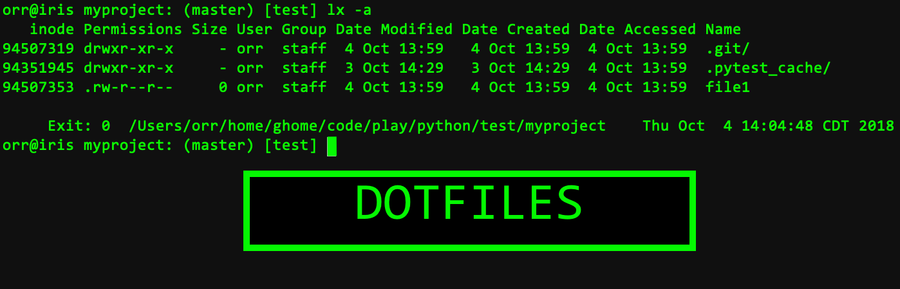

# Dotfiles (OSX)


## Using Setup
Put the dotfiles folder anywhere but your naked home directory.
Ex. ~/code/dotfiles
`git clone [repository] ~/code`

Run `setup.py` on the dotfiles folder to symlink the files to your home directory.

`./setup.py`

## Manually
Otherwise:
Create symbolic links to these files pointing to your home directory. Note: Don't use relative paths as this will cause symlinks to fail.

```
ln -s /Users/orr/code/dotfiles/.vimrc ~/
ln -s /Users/orr/code/dotfiles/.inputrc ~/
ln -s /Users/orr/code/dotfiles/.vim ~/
ln -s /Users/orr/code/dotfiles/.bash_profile ~/
```

